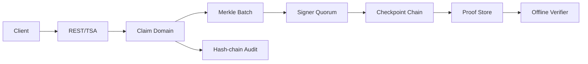

# Verifiable Timestamp Notary

纯 Go 1.23+ 的可验证时间戳与多方数字公证服务。服务只接收摘要和证明元数据，不保存用户文件本体。

## 能力

- 幂等时间戳声明、SHA-256/SHA-512 摘要格式校验与生命周期状态机。
- Merkle batch、proof path、周期 checkpoint 和多 signer quorum 聚合。
- RFC 3161 风格 JSON TSA 请求 `/tsa`，以及版本化 REST `/api/v1`。
- Proof 离线验证、撤销、保留期、签名者注册、key rotation 和哈希链审计。
- 内存存储用于本地运行；Store 接口可替换 PostgreSQL、对象存储和缓存适配器。

## 运行

```bash
go run ./cmd/notary
curl http://localhost:8090/healthz
```

先注册两个 signer，再创建声明并调用 `/api/v1/timestamp-requests/{id}/notarize`。完整 smoke 流程见 `scripts/smoke.sh`。

浏览器控制台页面位于 `web/index.html`，可由反向代理或静态文件服务器挂载；服务健康检查由 `runtime_smoke.json` 声明。

## 架构

领域层位于 `internal/notary`，Merkle/quorum/checkpoint/verifier/key lifecycle 分属独立包；transport 只负责请求校验和统一错误模型。审计事件按前置 hash 串接，服务停止使用优雅 shutdown。



SLO 建议：可用性 99.9%，健康检查 p99 小于 50ms，证明验证 p99 小于 100ms。生产部署应使用外部 Store、mTLS/OIDC adapter、KMS 密钥和周期 checkpoint anchor。
